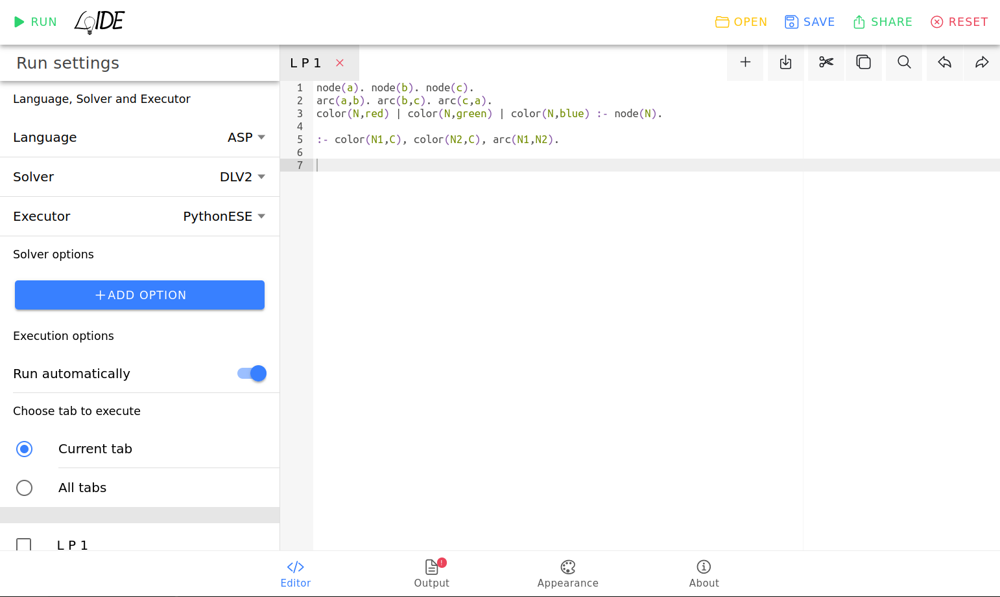

<!-- # LoIDE -->

<picture>
 <source media="(prefers-color-scheme: dark)" srcset="docs/images/logo_LoIDE_dark.svg">
 <source media="(prefers-color-scheme: light)" srcset="docs/images/logo_LoIDE.svg">
 
</picture>

**A web-based IDE for Logic Programming.**

<figure>
 <figcaption>LoIDE-PWA</figcaption>
 
 
<figure>

<figure>
 <figcaption>LoIDE-Classic</figcaption>
 
<!--  -->
 
<figure>

<!--
## Online Demo
Find a live demo at [loide.demacs.unical.it](https://loide.demacs.unical.it:8433)

Check the status of our services at https://loide.freshstatus.io
-->

<!-- This online version uses the [EmbASPServerExecutor](https://github.com/DeMaCS-UNICAL/EmbASPServerExecutor) to run the solvers -->

## Purpose

The LoIDE project aims to create a modular and extensible web-based Integrated Development Environment (IDE) for Logic Programming, utilizing modern technologies and languages.

The project also aims to develop a web-service offering a standardized set of APIs for various logic-based languages.  
For more details on the API, please refer to the [Wiki](https://github.com/DeMaCS-UNICAL/LoIDE/wiki/API).

## Key Features

 - **Open-source Server/Client**
   - Reference implementations available as Free and Open-Source Software (FOSS).
 - **Interoperable API**
   - Open API based on the _JSON Schema_ standard.
 - **Prototype Executor implementations**
   - Reference implementations of solver executors in various programming languages.
 - **Executor protocol**
   - Standard protocol for executors discovery and invocation.
 - **Responsive design**
   - Works seamlessly across various devices.
 - **Multi-language/solver**
   - Supports multiple logic programming languages and solvers.
 - **Executor instance selection**
   - Pick among different execution environments.
 - **Syntax highlighting**
   - Improved code readability with color-coded syntax.
 - **Multiple files support**
   - Work with and manage multiple files simultaneously.
 - **Output highlighting**
   -  Easily identify important information in output results.
 - **Layout/Appearance customization**
   - Tailor the IDE's look to your preference.
 - **Keyboard shortcuts**
   - Boost efficiency with keyboard shortcuts.
 - **Execution/Solver options configuration**
   - Fine-tune settings for specific tasks.
 - **Import/Export functionality**
   -  Save and share files and project settings easily.

## Components

As the LoIDE project has expanded significantly in recent years, we have established separate repositories for each component.
You can find these repositories here:

 - [LoIDE-PWA](https://github.com/DeMaCS-UNICAL/LoIDE-PWA)
   - Integrated Development Environment (IDE) for Logic Programming developed as a Progressive Web App (PWA)
 - [LoIDE-API-Server](https://github.com/DeMaCS-UNICAL/LoIDE-API-Server)
   - API server that acts as an intermediary between LoIDE clients and server-side executors
 - [LoIDE-Classic](https://github.com/DeMaCS-UNICAL/LoIDE-Classic)
   - Former version of LoIDE: a web-based IDE for Logic Programming
 - [PythonESE](https://github.com/DeMaCS-UNICAL/PythonESE)
   - Python web app to execute logic programs with different solvers, using the [EmbASP](https://github.com/DeMaCS-UNICAL/EmbASP) framework
 - [EmbASPServerExecutor](https://github.com/DeMaCS-UNICAL/EmbASPServerExecutor)
   - A Java application to run logic programs with different solvers, using the [EmbASP](https://github.com/DeMaCS-UNICAL/EmbASP) framework

<!--
## Contributing

Please read [CONTRIBUTING.md]() for details on our code of conduct, and the process for submitting pull requests to us.
 -->

## Versioning

We use [Semantic Versioning](http://semver.org) for versioning.  
Please refer to the [Releases](https://github.com/DeMaCS-UNICAL/LoIDE/releases) for a list of available versions.

## Credits

 - Stefano Germano (_Scientific Coordinator_)
 - Eliana Palermiti
 - Rocco Palermiti
 - Alexander Karaulshchikov
 - Giorgio Andronico
 - Marco Duca
 - Francesco Calimeri (_Scientific Supervisor_)

From the [Department of Mathematics and Computer Science](https://www.mat.unical.it) of the [University of Calabria](http://unical.it).

## License

This project is licensed under the [MIT License](LICENSE).
