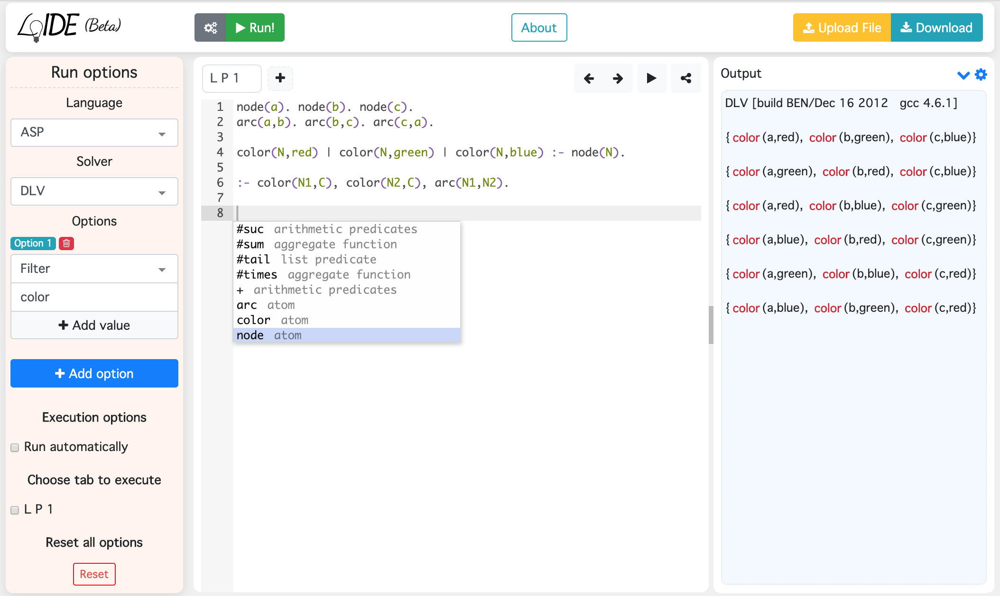

# LoIDE

LoIDE is a web-based IDE for Logic Programming.

## Team

- Stefano Germano (_Project Manager_)
- Eliana Palermiti
- Rocco Palermiti
- Alexander Karaulshchikov
- Francesco Calimeri

From the [Department of Mathematics and Computer Science](https://www.mat.unical.it) of the [University of Calabria](http://unical.it)

## Guidelines

General info are available in our [README](https://github.com/DeMaCS-UNICAL/LoIDE/blob/master/README.md)

### Users

See the guides in our Wiki:

- [Description](https://github.com/DeMaCS-UNICAL/LoIDE/wiki/Web-IDE-description)
- [Features](https://github.com/DeMaCS-UNICAL/LoIDE/wiki/Features)
- [Shortcuts](https://github.com/DeMaCS-UNICAL/LoIDE/wiki/Shortcuts)

### Developers

See our documentation:

- [Getting started](https://github.com/DeMaCS-UNICAL/LoIDE/blob/master/README.md#getting-started-installation-and-usage)
- [Execution flow](https://github.com/DeMaCS-UNICAL/LoIDE/wiki/Execution-flow)
- [APIs](https://github.com/DeMaCS-UNICAL/LoIDE/wiki/APIs)
- [Built with](https://github.com/DeMaCS-UNICAL/LoIDE/blob/master/README.md#built-with)
- [Versioning](https://github.com/DeMaCS-UNICAL/LoIDE/blob/master/README.md#versioning)

## Publications
