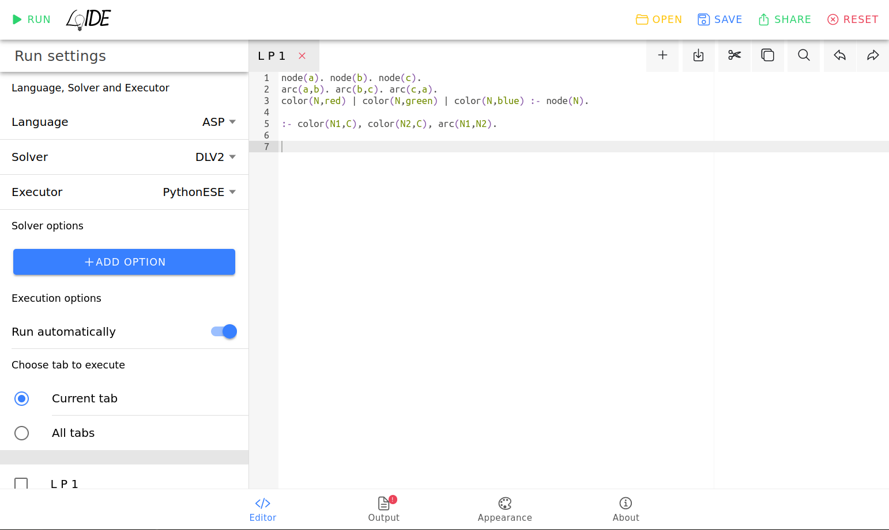

# _Lo_**IDE**

_Lo_**IDE** is a web-based IDE for Logic Programming.

<figure>
 <figcaption>LoIDE PWA</figcaption>
 
 
</figure>

<figure>
 <figcaption>LoIDE Classic</figcaption>
 
 
</figure>

<!--

Find a live demo at [loide.demacs.unical.it](https://loide.demacs.unical.it:8433)
-->

## Team

- Stefano Germano (_Scientific Coordinator_)
- Eliana Palermiti
- Rocco Palermiti
- Alexander Karaulshchikov
- Giorgio Andronico
- Marco Duca
- Francesco Calimeri (_Scientific Supervisor_)

From the [Department of Mathematics and Computer Science](https://www.mat.unical.it) of the [University of Calabria](http://unical.it).

### Contacts

loide "AT" mat.unical.it

## Guidelines

General info are available in our [README](https://github.com/DeMaCS-UNICAL/LoIDE/blob/master/README.md).

### Users

See the guides in our Wiki:

- [Description](https://github.com/DeMaCS-UNICAL/LoIDE/wiki/Layout-Overview)
- [Features](https://github.com/DeMaCS-UNICAL/LoIDE/wiki/Main-Features)
- [Shortcuts](https://github.com/DeMaCS-UNICAL/LoIDE/wiki/Keyboard-Shortcuts)

### Developers

See our documentation:

- [Getting started](https://github.com/DeMaCS-UNICAL/LoIDE/wiki/Getting-Started)
- [HTTP settings](https://github.com/DeMaCS-UNICAL/LoIDE/wiki/HTTP-ports-and-TSL-support)
- [Execution flow](https://github.com/DeMaCS-UNICAL/LoIDE/wiki/Execution-flow)
- [API](https://github.com/DeMaCS-UNICAL/LoIDE/wiki/API)
- [Built with](https://github.com/DeMaCS-UNICAL/LoIDE/blob/master/README.md#built-with)
- [Versioning](https://github.com/DeMaCS-UNICAL/LoIDE/blob/master/README.md#versioning)

## License

This project is licensed under the [MIT License](LICENSE).

## Publications

- Francesco Calimeri, Stefano Germano, Eliana Palermiti, Kristian Reale, Francesco Ricca  
_Developing ASP Programs with ASPIDE and LoIDE_  
Künstliche Intelligenz (KI 2018)  
[ paper](https://link.springer.com/article/10.1007%2Fs13218-018-0534-z)
- Stefano Germano, Francesco Calimeri, Eliana Palermiti  
_LoIDE: A Web-Based IDE for Logic Programming Preliminary Report_  
International Symposium on Practical Aspects of Declarative Languages (PADL 2018)  
[ paper](https://link.springer.com/chapter/10.1007%2F978-3-319-73305-0_10)
- Stefano Germano, Francesco Calimeri, Eliana Palermiti  
_LoIDE: a web-based IDE for Logic Programming - Preliminary Technical Report_  
ArXiv Preprint (ArXiv, 2017)  
[ paper](https://arxiv.org/abs/1709.05341)
